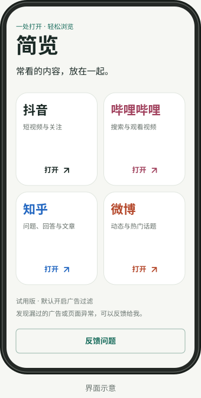

<p align="center"></p>

<h1 align="center">简览 · Jianlan</h1>
<p align="center">常看的内容，放在一起。</p>
<p align="center">一个 Android 应用，集中浏览 B 站、抖音、知乎和微博网页版，过滤已识别的广告和下载推广。</p>

<p align="center">
  <a href="https://github.com/xPeiPeix/jianlan/releases/download/v0.2.2/jianlan-0.2.2.apk"><strong>下载 Android APK</strong></a>
  · <a href="https://xpeipeix.github.io/jianlan/">下载页</a>
  · <a href="https://github.com/xPeiPeix/jianlan/releases/tag/v0.2.2">更新说明</a>
  · <a href="https://github.com/xPeiPeix/jianlan/issues/new?template=bug_report.yml">反馈问题</a>
</p>

## 现在可以做什么

- **四个平台，一个入口**：打开 B 站、抖音、知乎和微博网页版。
- **减少打扰**：过滤明确标记的广告和部分下载推广，随时可以关闭。
- **按页面需要切换**：提供刷新、返回，以及手机／电脑版网页切换。
- **方便反馈**：首页或网页菜单可以填写问题，复制或分享时附带版本、机型和 WebView 信息。

<p align="center"></p>
<p align="center"><sub>首页界面示意；实际显示随手机尺寸和字体设置变化。</sub></p>

## 下载与安装

当前版本 **0.2.2 · 早期试用**，最低要求 **Android 8.0**。推荐保持系统 Android WebView 为可用的新版本。

1. [下载 APK](https://github.com/xPeiPeix/jianlan/releases/download/v0.2.2/jianlan-0.2.2.apk)，在手机上打开安装。
2. 如果系统询问，允许当前浏览器或文件管理器安装此应用。
3. 打开简览，选择一个平台开始浏览；需要账号时在网站自己的页面登录。

如果装过之前单独提供的 **0.2.1 调试版**，它与本次发布包的签名不同，需要先卸载旧版。卸载会清除简览内的网站登录状态和设置。本次起的发布版本将沿用同一签名。

安装包与 [SHA256 校验文件](https://github.com/xPeiPeix/jianlan/releases/download/v0.2.2/SHA256SUMS)均在 [GitHub Releases](https://github.com/xPeiPeix/jianlan/releases) 中提供。

## 试用前了解

简览使用 Android WebView 展示各平台网页。推荐、搜索、关注、画质和内容权限取决于对应网站的网页能力。

- 只过滤已识别的广告样式，不保证所有页面完全无广告，也不会跳过创作者的视频口播。
- 0.2.1 已在 realme Android 14 手机上验证知乎阅读、微博视频播放和反馈分享。0.2.2 尚未重新完成真机回归；其他机型、登录后的完整流程还需要更多实际反馈。
- 页面异常时，可以先关闭顶部的过滤开关，再刷新页面比较。
- 简览自身没有账号系统或反馈上传服务。反馈通过 Android 复制／分享，由你选择发送；所访问网站仍按各自规则处理账号和数据。

## 发现问题

在 App 首页或右上角菜单点 **反馈问题**，描述操作步骤，再将反馈粘贴到 [GitHub Issues](https://github.com/xPeiPeix/jianlan/issues/new?template=bug_report.yml)。也可以直接在试用帖里回复。

请说明平台、手机型号、发生问题的操作，以及关闭过滤并刷新后是否恢复。截图先遮住账号等个人信息。优先反馈打不开、无法播放、误隐藏正常内容和漏过的广告。

## 本地构建

需要 JDK 17、Android SDK Platform 36 和 Build Tools 36.0.0：

```sh
export JAVA_HOME=/path/to/jdk-17
export ANDROID_HOME=/path/to/android-sdk
bash scripts/build.sh
node --test tests/cleaner.test.cjs
```

发布签名、构建命令及产物位置见 [构建说明](docs/building.md)。当前测试范围见 [验收记录](docs/verification.md)。

网页及其内容归对应网站和创作者所有，本项目与这些网站没有官方关联。实现与参考来源见 [第三方说明](THIRD_PARTY_NOTICES.md)。
